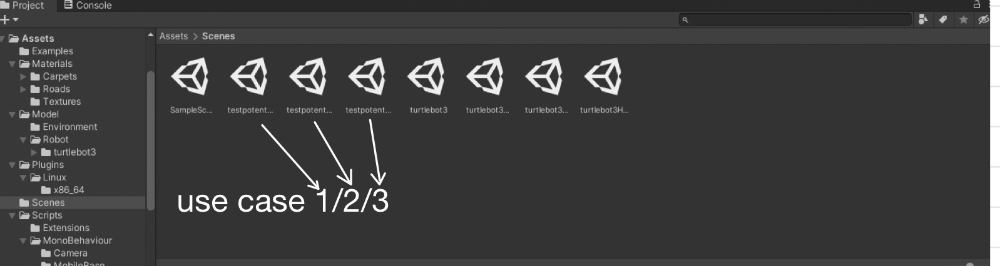
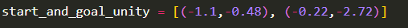
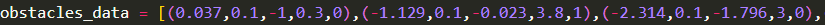
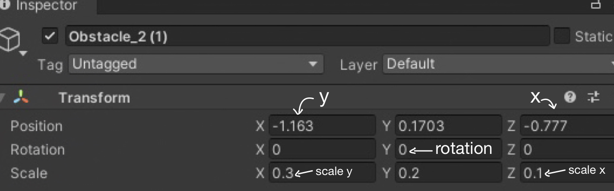
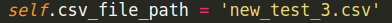

## Table of contents
* [General info](#general-info)
* [Setup](#setup)
  
## General info
This project is simple A* implementation using potential field as heuristic
## Setup
To run this project:

- Set up the environment in unity the file can be found in the folder Unity (choose a scene)
- Set up the robot and goal and obstacles as you want (3 use cases can be found already in scene under test_potential_1/2/3 names)
    

  

- Open the A_star.py file and define start,goal coordinates
  

  

- Define obstacle data as your unity environment and run the code (x, x_scale, y, y_scale, flag). The flag is 0 if the obstacle is vertical (0 rotation), 1 if horizontal (90 degrees rotation in unity)

  
  

- You'll get printed on terminal the coordinates of your path, you'll also get in images the process visualized and a video showing the algorithm work

  

https://github.com/Francesco-ds/Mobile-Robotics/assets/58468024/03033d52-d1e0-4d0d-b62b-2937110783d1

- Copy the coordinates in a file.csv
- In the map_following.py change this line with the name of the csv you have created
    

  

-Run the scene on unity and run the map_following.py to see your robot moving

[new_use_case_1.webm](https://github.com/Francesco-ds/Mobile-Robotics/assets/58468024/42e7a908-bbd3-4a1c-90c8-7dd97dd6cd01)

